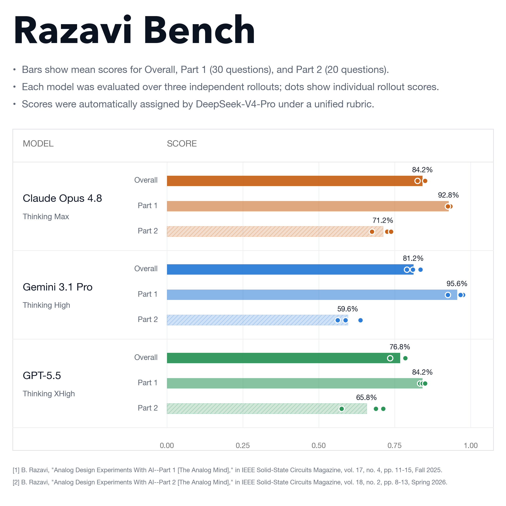

# Razavi-bench



Razavi-bench is a compact analog-design reasoning benchmark derived from
Behzad Razavi's *Analog Design Experiments With AI* Part 1 and Part 2 articles.
It packages the article questions into a clean one-task-per-directory layout for
evaluating whether a model can reason about MOS devices, small-signal circuits,
feedback, oscillators, comparators, dividers, LNAs, TIAs, and LC oscillators.

The benchmark keeps only the task prompt, figure, and curated golden answer.
The historical ChatGPT/Gemini responses and their article scores are not stored
as task data.

## Dataset

- 50 total tasks
- Part 1: 30 questions, article numbering Q1-Q30
- Part 2: 20 questions, article numbering Q1-Q20
- 44 task figures, stored directly beside each corresponding prompt
- No `task.toml` files
- No source PDFs in the repository

## Layout

```text
tasks/<part>-<number>-<semantic-slug>/
  instruction.md
  golden_solution.md
  figure-xx.png  # only when the question has a figure
```

Top-level files:

- `manifest.json` and `manifest.jsonl`: task index.
- `evaluation_rubric.md`: inferred 0-4 grading rubric summarized from Razavi's comments and scores.
- `verification/`: human audit notes and representative simulation checks used while curating the golden answers.

## Task Format

Each `instruction.md` contains only the benchmark prompt and any local figure
reference. It intentionally does not include source metadata, original model
answers, scores, or explanations.

Each `golden_solution.md` contains the expected reasoning and answer for
evaluation. These were reviewed against the source articles, figures, and
circuit analysis.

## Review Status

The golden answers have been reviewed task by task. The review record is in:

```text
verification/golden_solution_review.md
```

Representative ngspice/Sky130 checks are recorded in:

```text
verification/sky130_ngspice/summary.md
```

Those simulations validate selected device and trend claims. They are not meant
to be a one-netlist-per-task proof, because many questions are topology,
feedback, or conceptual reasoning tasks without specified sizes and biases.

## Notes

The user request originally mentioned 40 questions for Part 1, but the available
Part 1 article contains Q1 through Q30. No synthetic questions were added.

## References

- B. Razavi, "Analog Design Experiments With AI—Part 1 [The Analog Mind]," in
  IEEE Solid-State Circuits Magazine, vol. 17, no. 4, pp. 11-15, Fall 2025.
- B. Razavi, "Analog Design Experiments With AI—Part 2 [The Analog Mind]," in
  IEEE Solid-State Circuits Magazine, vol. 18, no. 2, pp. 8-13, Spring 2026.
