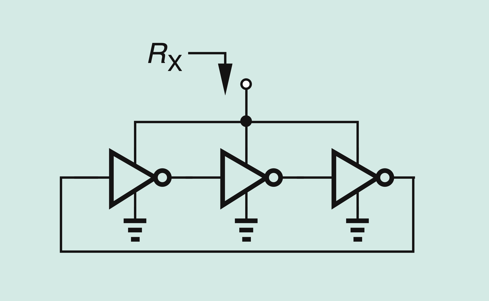

# part2-006-oscillates-change

## Question

For the ring oscillator in Figure 8, determine the small-signal resistance seen
looking into the supply node.

Use `CL` for the effective load capacitance at each internal oscillator node,
`f0` for the oscillation frequency, and `TD` for the delay of one inverter stage.

Somebody answers that this resistance can be estimated by treating each
inverter as two diode-connected devices in series, with the three inverter
stages in parallel:

```text
RX ~= (1/3) (1/gmp + 1/gmn)
```

Considering that the circuit is oscillating, do you agree with this answer?

## Figures


