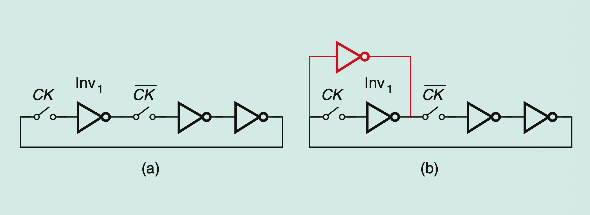

# part2-015-but-input-red-inverter-not-tied-output

## Question

In Figure 12(b), somebody answers:

> The red inverter acts as a keeper, forming a cross-coupled latch with `Inv1`.
> This removes the minimum clock frequency requirement due to leakage.

But the input of the red inverter is not tied to the output of `Inv1`.

Do you agree with this answer? What is the actual role of the red inverter?

## Figures

