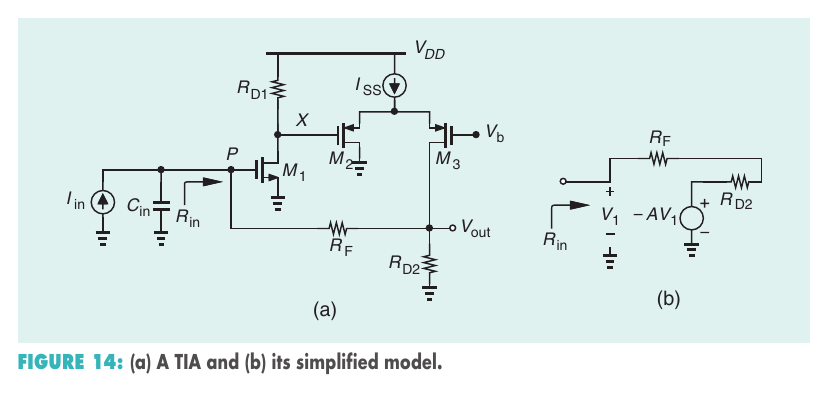

# part2-017-compute-input-impedance

## Question

For the circuit in Figure 14(a), somebody answers:

> This is a shunt-shunt feedback amplifier, so the input impedance is
>
> `Rin = RF / (1 + Avol)`,
>
> where
>
> `Avol = -(1/2) gm1 gm2,3 RD1 (RD2 || RF)`.

Do you agree with this answer? Compute the input impedance of the circuit.

## Figures

