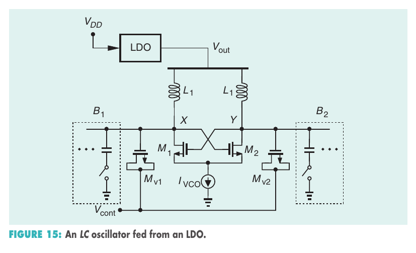

# part2-018-ldo-regulator-generates-thermal-noise-with-spectrum

## Question

If the LDO regulator in Figure 15 generates thermal noise with spectrum Sth, how do we compute the VCO output phase noise?

## Figures

